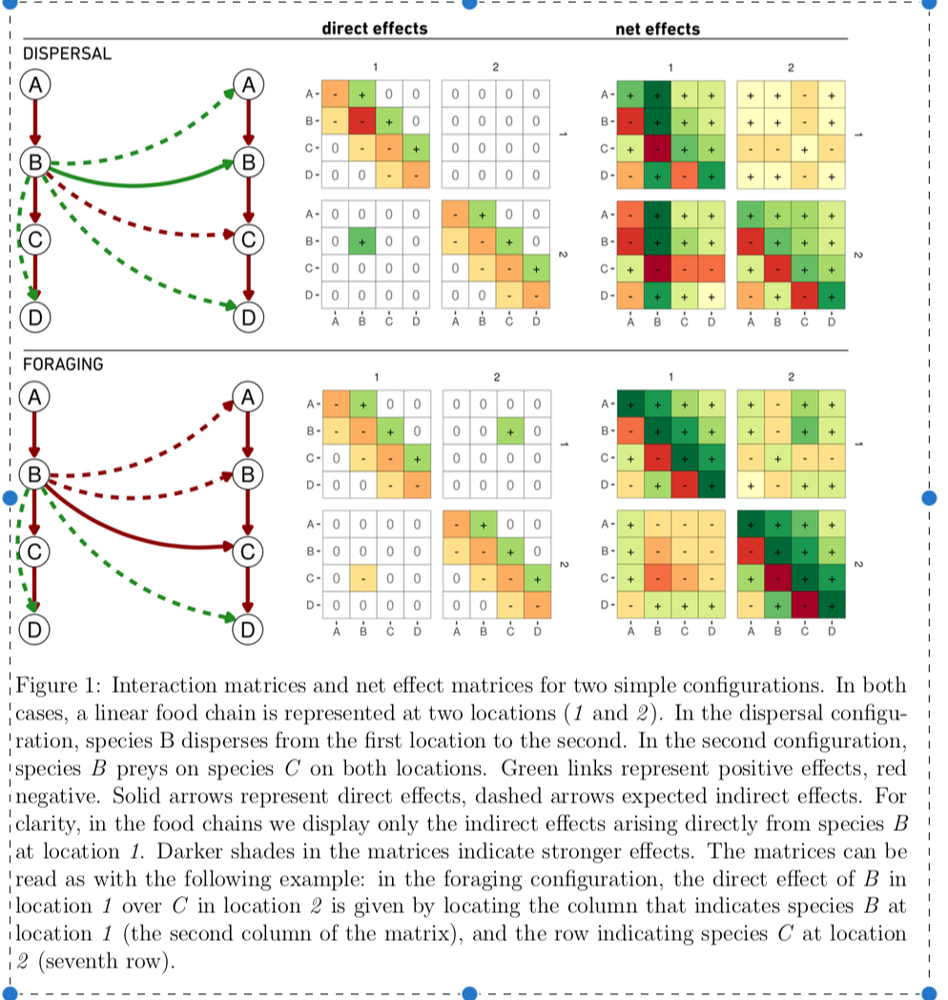

# Potential project ideas that were proposed

- Meta-ecosystem blueprint (develop the first truly empirical metaecosystem model)

- Pure theory development to unpack asymmetry in fluxes
  - Get two-patch metaecosystem models closer to empirical systems by looking at couplings between different type of ecosystem (Forest-lake, benthic-pelagic..). Look at how different fluxes influence stability.
  - Reciprocal vs. asymmetry of fluxes on stability

- Literature review on spatial cascade
  - Review literature in the light of the meta-ecosystem concept to highlight the relevance of the spatial cascade concept

- Using two datasets (Swiss and TRCA) to look at by-product of meta-ecosystem dynamics using proxies of fluxes and ecosystem boxes (e.g., co-variance between insectivorous birds and aquatic organisms )

By the end of the first day, the group agreed that we should focus on one strong manuscript in the fear of dividing our forces too much, acknowledging that follow-up projects might unfold. *If subset of participants decide to start such follow-up or related project emerging from the working group meetings, then we ask that each participant is given an opt-in.*

Given the current direction of the conceptual manuscript, the general idea is to integrate the meta-ecosystem blueprint within that manuscript. The current conceptual manuscript is focussed on the regional consequences of spatial cascades on ecosystem function. While appealing, it is hard to make the case for an effect from local to regional when no theory exists for local metaecosystem dynamics in natural systems. The blueprint would be the first example of metaecosystem theory that is modeled around an actual ecosystem.  We all agreed that it would strengthen the main argument we are making in the paper by showing how the framework can actually be used on a real ecosystem (an outline of how to integrate the blueprint within the current manuscript is proposed at the end of this document).

# Meta-ecosystem blueprint (short project description)

## Main objective
- Developing the first empirical metaecosystem model.

## Approach:
The general idea is to follow the method developed in Garcias-Callejas et al., 2019 (https://doi.org/10.1101/469486) to determine indirect spatial effects (see figure below extracted from the article and the associated legend for explanations) in a natural meta-ecosystem. This would allow us to demonstrate the relevance of the concept for real ecosystems.

### Finding the right data
Upon searching the literature, two relevant data (i.e., data including within ecosystem fluxes with biotic compartments AND among ecosystem fluxes) were found (Hubbard brook, and Northern Highland Lake District). At the end, it was decided to use Hubbard brook largely because of its iconic nature and because of the completeness of the data. Our primary source of information were the Likens 1985 book ("An ecosystem approach to aquatic ecology") for data on Mirror lake, and Fahey et al., 2005 for data on the forest ecosystem.

Based on the information found we could start working on a blueprint for our metaecosystem:

The main references and the extracted data can be found in the hubbard_brook_fluxes_data_LD.xlsx file on the Github repo of the working group (https://github.com/harveye/CIEE_METECO). Also please note that the blueprint illustrated on the photo above will need to be updated to reflect the final jacobian matrix (compartments and arrows might be added or removed).

### Building the model around the blueprint
Main steps:

- Build the direct effect matrix (as per figure above - was done during working group). The Jocabian matrix is in the Jacobian_METAECO_Hubbard.xlsx document in the Github repository (also please note that each entry of the matrix is linked to a specific row in the fluxes data):

- Build the jacobian from the direct effect matrix (to be done)
- Inverse the jacobian to get the 'net' effect matrix (as per figure above) (to be done)
- Voilà!

# Manuscript outline
We did not have time for a group discussion on this. Based on one on one discussions I had with different participants here is my proposition for how to incorporate the blueprint, which would become the core of the article, within the current manuscript.

## 1. Toward a useful metaecosystem theory (let's be bold!)
Here we place our work in the following context:
- Global ecosystems are in a fragile balance with sometime important parts of their budget being dependent on external fluxes (Polis et al., 1997). The metaecosystem concept proposes that....
- Metaecosystem theory, although being wide and plenty in the literature, is not currently useful for empirical purpose because of its high level of abstraction using unrealistic assumptions for natural systems. (could potentially give the metacommunity theory as a contrast here)
- To demonstrate that metaecosystem can be useful in natural systems we need to first build models based on real systems. For this, a focus on spatial cascades in particular could be especially relevant.
- *Here we propose to i) build the first empirical metaecosystem model based on the Hubbard brook lake-forest couplings. We then ii) discuss the need to develop an understanding of the regional level implications of spatial cascades, and finally iii) discuss future challenges in the implementation of the metaecosystem concept to empirical systems (i.e., very greedy on data needed)*

## 2. The first metaecosystem blueprint
We present the blueprint with nice figures and results.

## 3. Implications of metaecosystem dynamics for the regional scale - the next frontier
Here we basically recycle almost everything from the current manuscript (a reduced more synthetic version), discussing how local spatial cascade could have regional scale implications for ecosystem functioning, and how a similar matrix-based framework to the one we used for the blueprint can be used to scale-up to the regional scale. Basically, the matrix approach used in section 2 can be equivalent to the framework we developed in the first version of the manuscript. The direct effect matrix is the outcome of the product of a physical connectivity (landscape configuration) and a movement matrix.

## 4. Empirical metaecosystems: implementation and future challenges
The problem indeed is that there are few Hubbard brook out there and probably no data including fluxes for a whole landscape. Here it could be interesting to discuss challenges in terms of actual implementation. No one will ever monitor all fluxes at the whole watershed level and not so many systems are monitored at the Hubbard Brook level. To be really useful we will need to understand how to use currently available data to test metaecosystem predictions (what Kevin M. named "byproducts of metaecosystem dynamics"). I don't think we can offer a final answer here - this is an opening and this ties in with one of our project ideas mentioned in the first section of this document using the Swiss and TRCA data. We could also discuss issues related to temporal dynamics (fluxes in nature are not at steady state as assumed with our approach and the strength of spatial cascade will vary widely with time), scaling movements of organisms from different trophic level in the landscape (to extend at landscape scale we need to include those movements), and the bi-directional nature of fluxes and potential feedbacks (highlighting that evidence suggest that donor-control is probably more the rule than the exception and citing here Gounand et al., 2019 NATCOM).
